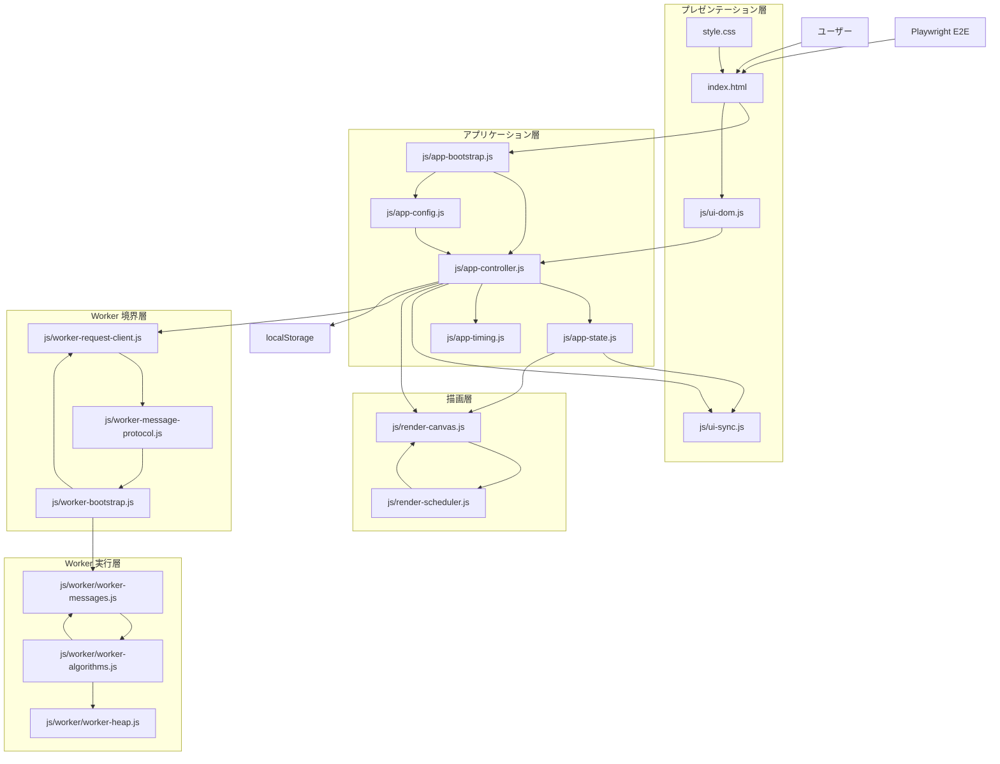

# Shos.Maze

[English README](README.md)


[](https://www2.shos.info/shosmaze/)

ブラウザ上で動作する迷路生成・経路探索可視化アプリです。Sources 配下の HTML / CSS / Vanilla JavaScript で構成されており、迷路生成、A* による探索、最短経路ハイライトをクライアントサイドのみで実行します。

## 概要

Shos.Maze は、Maze Forge: Generator & Pathfinding Explorer として実装されている 2D 迷路 Web アプリです。初期表示時に迷路を自動生成し、Generate Maze で再生成、Start Exploration で探索アニメーションを開始できます。

大規模迷路に対応するため、Canvas 描画、Web Worker による重い計算の分離、差分描画、typed array ベースのデータ管理などの高速化が入っています。

## Demo

ローカル環境を用意しなくても、公開ページを開くだけで迷路生成、探索アニメーション、最短経路ハイライトをすぐ確認できます。

- 公開ページ: [https://www2.shos.info/shosmaze/](https://www2.shos.info/shosmaze/)

## スクリーンショット

初期表示で Ready 状態に到達した画面です。

[デモを開く](https://www2.shos.info/shosmaze/)

| Desktop | Mobile |
| --- | --- |
|  |  |

## アーキテクチャ



## 主な機能

- 迷路の自動生成
- A* による経路探索の可視化
- 最短経路のハイライト表示
- Difficulty 切り替えによる迷路サイズ変更
- localStorage による Difficulty の保存と復元
- レスポンシブな Canvas 描画
- Web Worker を用いた generate / solve 処理の分離
- Playwright による E2E テスト

現在の Difficulty とグリッドサイズは以下です。

- Easy: 25 x 25
- Normal: 51 x 51
- Hard: 101 x 101
- Super Hard: 201 x 201

## 使用技術

- HTML5
- CSS3
- Vanilla JavaScript ES6+
- Canvas API
- Web Worker
- Node.js
- Playwright

補足:

- アプリ本体はクライアントサイドのみで動作します。
- Node.js はローカル確認用の静的サーバーと E2E テスト実行に使用します。
- 外部フロントエンドライブラリは使用していません。

## ディレクトリ構成

```text
.
├─ README.md
├─ README.ja.md
├─ LICENSE
├─ package.json
├─ package-lock.json
├─ playwright.config.js
├─ README-assets/
│  ├─ shos-maze-home-mobile.png
│  └─ shos-maze-home.png
├─ Dist/
│  ├─ index.html
│  ├─ style.css
│  ├─ favicon.svg
│  └─ js/
│     ├─ main.min.js
│     └─ worker-bootstrap.js
├─ Scripts/
│  └─ build-min.js
├─ Prompts/
│  ├─ maze-webapp-prompt.md
│  ├─ maze-webapp-prompt-summary.md
│  └─ sourcecode-comment-prompt.md
├─ Specifications/
│  └─ maze-webapp-specification.md
├─ Sources/
│  ├─ index.html
│  ├─ style.css
│  ├─ favicon.svg
│  └─ js/
│     ├─ app-bootstrap.js
│     ├─ app-config.js
│     ├─ app-controller.js
│     ├─ app-state.js
│     ├─ app-timing.js
│     ├─ render-canvas.js
│     ├─ render-scheduler.js
│     ├─ ui-dom.js
│     ├─ ui-sync.js
│     ├─ worker-bootstrap.js
│     ├─ worker-message-protocol.js
│     ├─ worker-request-client.js
│     └─ worker/
│        ├─ worker-algorithms.js
│        ├─ worker-heap.js
│        └─ worker-messages.js
├─ Tests/
│  ├─ e2e/
│  │  └─ maze-runtime.spec.js
│  └─ support/
│     └─ static-server.js
└─ Works/
	└─ Plans/
		├─ maze-webapp-development-plan.md
		├─ maze-webapp-performance-tuning-report.md
		├─ maze-webapp-runtime-bugfix-and-testing-plan.md
		├─ maze-webapp-runtime-bugfix-testing-report.md
		├─ maze-webapp-sources-refactoring-plan.md
		└─ maze-webapp-spec-implementation-gap-review.md
```

主要ディレクトリの役割は以下です。

- Dist: 静的ホスティング向けに生成した配布物
- Prompts: このリポジトリで使ったプロンプト類の記録
- Scripts: minify 配布ビルドなどの自動化スクリプト
- Specifications: 現行仕様書
- Sources: アプリ本体
- Tests: Playwright E2E と静的サーバー
- Works/Plans: 計画書、検証記録、改善レポート

Sources/js 配下の主要ファイルの役割は以下です。

- index.html: 画面のエントリポイントと classic script の読み込み順定義
- style.css: UI とレスポンシブレイアウト
- js/app-config.js: Difficulty、表示文言、配色、Worker 設定
- js/app-state.js: アプリ状態と描画進行状態
- js/app-controller.js: 状態遷移、操作制御、generate / solve の進行管理
- js/render-canvas.js: 迷路、探索済みセル、最短経路の Canvas 描画
- js/render-scheduler.js: 描画要求のフレーム集約
- js/worker-request-client.js: Worker への要求発行、cancel、stale result 抑制
- js/worker-bootstrap.js: Worker 側の起動入口
- js/worker/: 迷路生成、A* 探索、heap、Worker メッセージ処理

## 利用方法

### 1. Sources 版をローカルで確認する

このアプリは Web Worker を利用するため、ローカル確認は静的サーバー経由を前提にしてください。リポジトリにはテストでも使っている簡易サーバーが含まれています。

```bash
node ./Tests/support/static-server.js
```

起動後、ブラウザで以下にアクセスします。

```text
http://127.0.0.1:4173
```

### 2. Dist 版をローカルで確認する

まず minify 済み配布ファイルを生成します。

```bash
npm run build:min
```

その後、以下のいずれかで Dist を配信します。

```bash
npx serve ./Dist
```

または

```bash
node ./Tests/support/static-server.js Dist
```

既存の Node 製静的サーバーを使う場合は、以下へアクセスします。

```text
http://127.0.0.1:4173
```

### 3. 基本操作

1. 初期表示後、迷路が自動生成されます。
2. Difficulty でサイズを切り替えます。
3. Generate Maze で現在の Difficulty の迷路を再生成します。
4. Start Exploration で探索アニメーションを開始します。
5. 探索完了後、最短経路がハイライト表示されます。

## 開発とテスト

### 依存関係のインストール

```bash
npm install
```

### minify 済み配布ファイルの生成

配布用のファイルを Dist 配下に生成します。

```bash
npm run build:min
```

このコマンドで以下が生成されます。

- Dist/index.html
- Dist/js/main.min.js
- Dist/js/worker-bootstrap.js
- Dist/style.css
- Dist/favicon.svg

### Dist 配布手順

Dist 配下の内容を静的サイトとして公開してください。

1. `npm run build:min` を実行します。
2. Dist 配下のファイル群を静的ホスティング先へ配置します。
3. Dist/index.html を公開エントリにするか、Dist をそのままサイトルートとして配信します。

初回のみ Playwright のブラウザをインストールしてください。

```bash
npx playwright install chromium
```

### E2E テスト実行

```bash
npm run test:e2e
```

表示を見ながら確認する場合:

```bash
npm run test:e2e:headed
```

デバッグ実行:

```bash
npm run test:e2e:debug
```

現在の E2E では主に以下を確認しています。

- 初回ロードの正常化
- favicon 読み込み
- Generate の正常動作
- Solve の正常動作
- rapid difficulty change 時の stale request 抑制
- Explore 中の Generate 連打防御
- Explore 中の difficulty change 防御
- Worker 非対応時の graceful degradation

## 補足

- 仕様書は Specifications 配下にあります。
- 開発計画、リファクタリング記録、性能改善記録、ランタイム修正とテスト記録は Works/Plans 配下にあります。
- パフォーマンス改善では、1 次元 cellId 表現、typed array、静的レイヤーキャッシュ、差分描画、Path2D、Worker オフロード、request cancel が導入されています。

## 著者

Fujio Kojima: 日本のソフトウェア開発者
* Microsoft MVP for Development Tools - Visual C# (Jul. 2005 - Dec. 2014)
* Microsoft MVP for .NET (Jan. 2015 - Oct. 2015)
* Microsoft MVP for Visual Studio and Development Technologies (Nov. 2015 - Jun. 2018)
* Microsoft MVP for Developer Technologies (Nov. 2018 - Jun. 2026)
* [MVP Profile](https://mvp.microsoft.com/en-US/mvp/profile/4185d172-3c9a-e411-93f2-9cb65495d3c4 "MVP Profile")
* [Blog (Japanese)](http://wp.shos.info "Blog (Japanese)")
* [Web Site (Japanese)](http://www.shos.info "Web Site (Japanese)")
* [Twitter](https://twitter.com/Fujiwo)
* [Instagram](https://www.instagram.com/fujiwo/)

## ライセンス

このプロジェクトは MIT License の下で提供されています。詳細は [LICENSE](LICENSE) を参照してください。