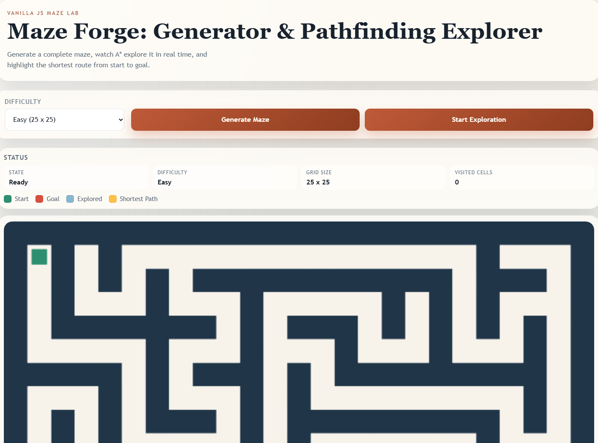
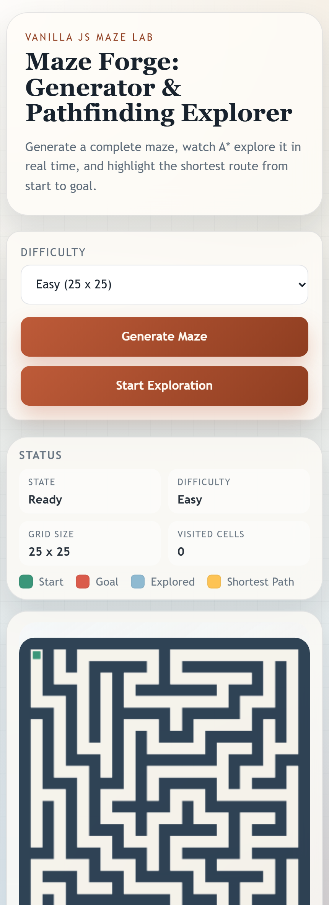
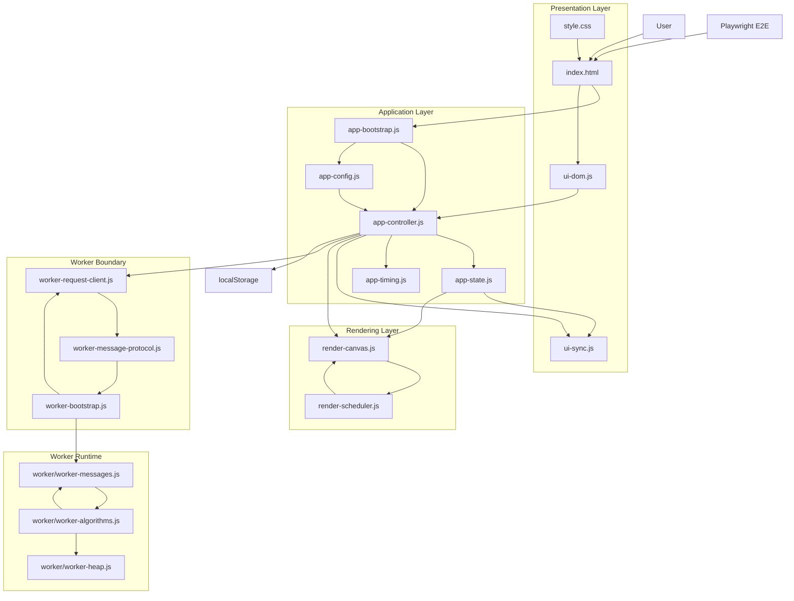

# Shos.Maze

[Japanese README](README.ja.md)


Shos.Maze is a browser-based maze generation and pathfinding visualization app. The implementation lives under Sources and is built with HTML, CSS, and Vanilla JavaScript. Maze generation, A* exploration, and shortest-path highlighting all run on the client side.

| Item | Summary |
| --- | --- |
| Purpose | Visualize maze generation and A* pathfinding in the browser |
| Stack | HTML, CSS, Vanilla JavaScript, Canvas, Web Worker |
| Difficulty Levels | Easy 25x25, Normal 51x51, Hard 101x101, Super Hard 201x201 |
| Performance Work | 1D cellId model, typed arrays, diff rendering, static canvas cache, Worker offloading |
| Test Coverage | Playwright E2E for load, generate, solve, cancellation, and interaction locking |

## Overview

Shos.Maze is a 2D maze web app implemented as Maze Forge: Generator & Pathfinding Explorer. It generates a maze automatically on initial load, lets you regenerate it with Generate Maze, and starts the exploration animation with Start Exploration.

The current implementation also includes large-maze performance work such as Canvas rendering, Web Worker offloading for heavy computation, diff-based drawing, and typed-array-backed data structures.

## Screenshot

Initial screen after the app reaches the Ready state.

| Desktop | Mobile |
| --- | --- |
|  |  |

## Architecture



## Main Features

- Automatic maze generation
- A* pathfinding visualization
- Shortest-path highlight animation
- Difficulty switching with different maze sizes
- Difficulty persistence via localStorage
- Responsive Canvas-based rendering
- Web Worker based separation for generate / solve processing
- Playwright E2E coverage

Current difficulty levels and grid sizes:

- Easy: 25 x 25
- Normal: 51 x 51
- Hard: 101 x 101
- Super Hard: 201 x 201

## Tech Stack

- HTML5
- CSS3
- Vanilla JavaScript ES6+
- Canvas API
- Web Worker
- Node.js
- Playwright

Notes:

- The app itself is fully client-side.
- Node.js is used for local static serving and E2E test execution.
- No external frontend library is used.

## Directory Structure

```text
.
├─ README.md
├─ README.ja.md
├─ LICENSE
├─ package.json
├─ package-lock.json
├─ playwright.config.js
├─ README-assets/
│  ├─ shos-maze-home-mobile.png
│  └─ shos-maze-home.png
├─ Prompts/
│  ├─ maze-webapp-prompt.md
│  ├─ maze-webapp-prompt-summary.md
│  └─ sourcecode-comment-prompt.md
├─ Specifications/
│  └─ maze-webapp-specification.md
├─ Sources/
│  ├─ index.html
│  ├─ style.css
│  ├─ app-bootstrap.js
│  ├─ app-config.js
│  ├─ app-controller.js
│  ├─ app-state.js
│  ├─ app-timing.js
│  ├─ render-canvas.js
│  ├─ render-scheduler.js
│  ├─ ui-dom.js
│  ├─ ui-sync.js
│  ├─ worker-bootstrap.js
│  ├─ worker-message-protocol.js
│  ├─ worker-request-client.js
│  ├─ favicon.svg
│  └─ worker/
│     ├─ worker-algorithms.js
│     ├─ worker-heap.js
│     └─ worker-messages.js
├─ Tests/
│  ├─ e2e/
│  │  └─ maze-runtime.spec.js
│  └─ support/
│     └─ static-server.js
└─ Works/
   └─ Plans/
      ├─ maze-webapp-development-plan.md
      ├─ maze-webapp-performance-tuning-report.md
      ├─ maze-webapp-runtime-bugfix-and-testing-plan.md
      ├─ maze-webapp-runtime-bugfix-testing-report.md
      ├─ maze-webapp-sources-refactoring-plan.md
      └─ maze-webapp-spec-implementation-gap-review.md
```

Main directory roles:

- Prompts: prompt records used for this repository
- Specifications: current formal specification
- Sources: application source files
- Tests: Playwright E2E tests and the local static server
- Works/Plans: planning notes, verification records, and tuning reports

Key files under Sources:

- index.html: app entry point and classic script load order
- style.css: UI styling and responsive layout
- app-config.js: difficulty options, labels, palette, and Worker settings
- app-state.js: application state and render progress state
- app-controller.js: state transitions, UI control, and generate / solve flow
- render-canvas.js: Canvas rendering for maze, explored cells, and shortest path
- render-scheduler.js: frame-level render request batching
- worker-request-client.js: Worker requests, cancellation, and stale-result suppression
- worker-bootstrap.js: Worker entry point
- worker/: maze generation, A* search, heap, and Worker-side message handling

## Usage

### 1. Run the app locally

Because the app uses Web Workers, local verification should be done through a static server. The repository already includes the lightweight server used by the test setup.

```bash
node ./Tests/support/static-server.js
```

Then open:

```text
http://127.0.0.1:4173
```

### 2. Basic flow

1. A maze is generated automatically on initial load.
2. Change the size with the Difficulty selector.
3. Regenerate the current maze with Generate Maze.
4. Start the exploration animation with Start Exploration.
5. After exploration completes, the shortest path is highlighted.

## Development and Testing

### Install dependencies

```bash
npm install
```

Install the Playwright browser once:

```bash
npx playwright install chromium
```

### Run E2E tests

```bash
npm run test:e2e
```

Run with a visible browser:

```bash
npm run test:e2e:headed
```

Debug mode:

```bash
npm run test:e2e:debug
```

Current E2E coverage mainly checks:

- initial load and ready state
- favicon loading
- Generate behavior
- Solve behavior
- stale-request suppression during rapid difficulty changes
- Generate spam protection while exploring
- difficulty-change protection while exploring
- graceful degradation when Web Worker is unavailable

## Notes

- The formal specification lives under Specifications.
- Development plans, refactoring notes, performance tuning records, and runtime testing notes live under Works/Plans.
- Performance-oriented changes include 1D cellId-based data representation, typed arrays, static layer caching, diff rendering, Path2D batching, Worker offloading, and request cancellation.